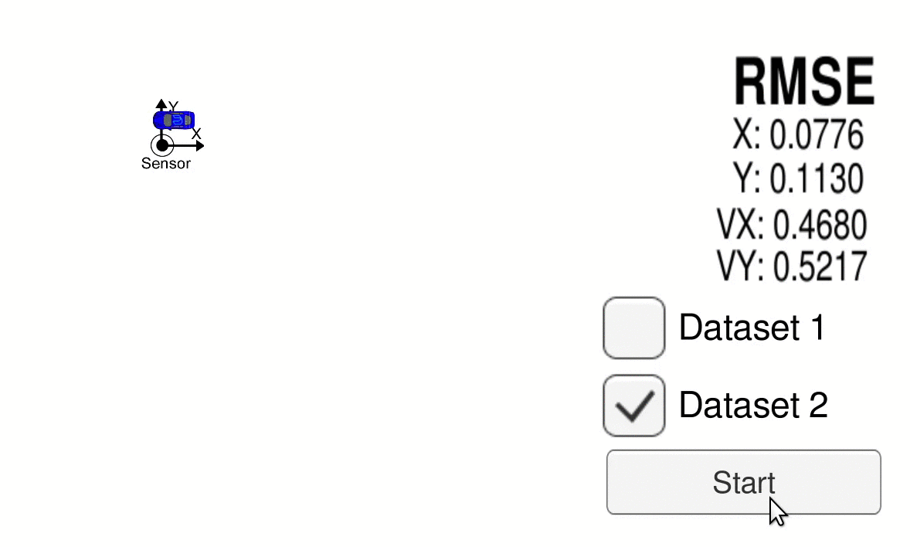

Kalman Filter Implementations
===

This repository has two implementations of kalman filters:

* Extended Kalman Filter in _ekf_ subdirectory
* Unscented Kalman Filter in _ukf_ subdirectory

**EKF filter in action:**



**UKF filter in action:**


### Compile

These Kalman Filters work with [Udacity car simulator](https://github.com/udacity/self-driving-car-sim/releases/). Follow instructions to install simulator on your local machine.

* Install dependencies:
  - macOS:
  ```bash
  $ ./install-mac.sh
  ```
  - Ubuntu:
  ```bash
  $ ./install-ubuntu.sh
  ```

* Compile both EKF and UKF:
```bash
$ cmake .
$ make
```

* Compile either EKF or UKF:
```bash
$ KALMAN_FILTER_DIRECTORY=ukf
$ cd $KALMAN_FILER_DIRECTORY
$ cmake .
$ make
```

After these steps you will have binary files of UKF and EKF filters:

```bash
$ ls -al ukf/ ekf/ | grep '.*kf'
ekf/:
-rwxrwxr-x 1 artemav artemav 1163632 May 31 23:24 ekf
ukf/:
-rwxrwxr-x 1 artemav artemav 1580016 May 31 22:41 ukf
```

### Run

1. Run either EKF or UKF filter:
```bash
$ ./ukf/ukf
Listening to port 4567
```

2. Run simulator:
  ```bash
  $ ./term2_sim_linux/term2_sim.x86_64
  Set current directory to /home/artemav/code/kalman_filters
  Found path: /home/artemav/code/kalman_filters/term2_sim_linux/term2_sim.x86_64
  Mono path[0] = '/home/artemav/code/kalman_filters/term2_sim_linux/term2_sim_Data/Managed'
  Mono path[1] = '/home/artemav/code/kalman_filters/term2_sim_linux/term2_sim_Data/Mono'
  Mono config path = '/home/artemav/code/kalman_filters/term2_sim_linux/term2_sim_Data/Mono/etc'
  displaymanager : xrandr version warning. 1.5
  client has 4 screens
  displaymanager screen (0)(DP-0): 3840 x 2160
  Using libudev for joystick management

  Importing game controller configs
  ```
